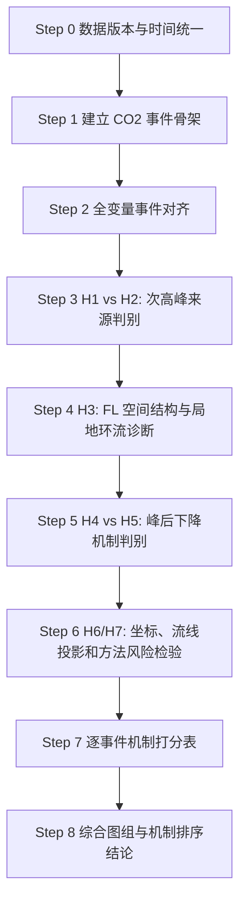

# CO2 事件竞争假设执行计划与 Codex 目标说明

记录日期：2026-06-04  
上游状态文件：`next_step/2026-06-04_CO2_event_competing_hypotheses_status.md`  
用途：把 CO2 事件竞争假设从“状态整理”推进到“可执行数据处理顺序、交付成果和 Codex 任务说明”。

---

## 0. 执行边界

本计划服务于 09:00 左右 CO2 次高峰的事件级机制排序。当前阶段不要求先把 CVT/MT 固定塔 raw `w` 总输送重算为 fixed-tower `F_anom`。固定塔主证据优先使用：

1. CO2 廓线与事件时序；
2. EA/EC `w'c'` 口径结果；
3. CO2 上升/下沉气团结构；
4. 三站水平风；
5. FL moving-transect CO2 anomaly transport 空间形态；
6. raw-w、rotation、风向扇区、FL 移动方向作为方法风险或敏感性约束。

FL 的定位必须保持为：**移动切面 CO2 异常输送诊断和空间结构证据**。不得写成独立 EC 通量算法或第三个固定平均通量站。

---

## 1. 总处理流程



---

## 2. Step 0：数据版本冻结与公共时间轴

### 目的

防止后续不同表格时间错位、窗口定义不一致、FL pass 与固定塔事件无法对应。

### 输入

- MT、CVT、FL 高频数据；
- 30 min EA/EC 结果；
- 5 min/30 min raw-w 结果；
- AP/profile CO2 廓线；
- MET 与三站水平风；
- FL 位置和移动方向数据。

### 处理

1. 全部转换为 `Asia/Shanghai`。
2. 建立统一字段：`timestamp_local`、`date`、`time_of_day`、`event_date`。
3. 明确每个数据源的频率：高频、1 min、5 min、30 min。
4. 输出所有数据源的覆盖范围、缺测比例和时间间隔统计。

### 交付表

- `next_step/00_data_inventory.csv`
- `next_step/00_time_axis_check.csv`
- `next_step/00_variable_dictionary.csv`

### 可视化

- `fig00_data_coverage_gantt.png`：每个数据源时间覆盖甘特图。
- `fig00_timestamp_interval_hist.png`：时间戳间隔直方图。
- `fig00_missingness_heatmap.png`：数据缺测热图。

### 通过标准

每个事件日能明确哪些变量可用、哪些缺失、哪些只能做背景解释。

---

## 3. Step 1：建立 CO2 事件骨架

### 目的

所有竞争假设共用同一套事件阶段，避免各假设各自选窗口。

事件阶段固定为：

\[
\text{峰前背景}
\rightarrow
\text{廓线结构切换}
\rightarrow
\text{CO2 前期低点}
\rightarrow
\text{CO2 回升/次高峰}
\rightarrow
\text{峰后下降}
\]

### 输入

- CVT/MT/FL CO2 时间序列；
- AP/profile CO2 廓线；
- 日出时间或既定日出参考线。

### 处理

对每个事件日识别：

- `t_profile_switch`
- `t_pre_min`
- `t_secondary_peak`
- `t_post_decline_end`

并计算：

- 峰前背景 CO2；
- 前期低点 CO2；
- 次高峰 CO2；
- 回升幅度；
- 峰后下降速率；
- 各节点相对 `t_secondary_peak` 的 lead-lag。

### 交付表

- `next_step/01_event_master_table.csv`

建议字段：

- `date`
- `station`
- `t_sunrise`
- `t_profile_switch`
- `t_pre_min`
- `t_peak2`
- `t_decline_end`
- `co2_pre_bg`
- `co2_min`
- `co2_peak2`
- `co2_rise_amplitude`
- `co2_decline_rate`
- `lag_profile_switch_to_peak2`
- `lag_pre_min_to_peak2`

### 可视化

- `fig01_event_timeline_by_day.png`：每日 CO2 时间线，叠加 profile switch、pre-min、secondary peak、post-decline。
- `fig02_event_phase_lag_matrix.png`：行是事件日，列是关键节点，颜色表示相对 `t_peak2` 的时间差。
- `fig03_station_co2_phase_alignment.png`：CVT、MT、FL CO2 以 `t_peak2 = 0` 对齐，比较三站相位。

---

## 4. Step 2：全变量事件对齐表

### 目的

把 CO2、风场、EA/EC、raw-w、FL、廓线放入同一事件窗口。

### 输入

- `01_event_master_table.csv`
- 30 min EA/EC
- 5 min/30 min raw-w
- 1 min/5 min/30 min 风场
- AP/profile
- FL pass-level 和 position-bin 结果

### 处理

按事件阶段聚合变量：

- `pre_bg`
- `profile_transition`
- `pre_min`
- `rise_to_peak`
- `peak2`
- `post_decline`
- `midday`
- `night`

### 交付表

- `next_step/02_event_aligned_5min.csv`
- `next_step/02_event_aligned_30min.csv`
- `next_step/02_event_phase_summary.csv`

建议字段：

- `wind_speed`
- `wind_dir`
- `corrected_wind_sector`
- `u_mean`
- `v_mean`
- `w_mean_raw`
- `sigma_w`
- `ustar`
- `H`
- `F_EC_cov`
- `F_EA_general`
- `c_up`
- `c_down`
- `c_up_minus_down`
- `F_air`
- `F_conc_anom`
- `profile_gradient`
- `column_co2_proxy`

### 可视化

- `fig04_multivariable_event_panel.png`：每日事件窗口内显示 CO2、风速、风向、`w_mean`、`F_EC`、`c_up-c_down`、profile 指标。
- `fig05_variable_lag_to_peak2.png`：判断哪些变量稳定早于、接近或晚于 CO2 次峰。
- `fig06_phase_boxplot_by_variable.png`：比较每个变量在五个事件阶段的分布变化。

---

## 5. Step 3：H1 vs H2，判断 CO2 次高峰从哪里来

H1：夜间储存层释放 + 日出后廓线/边界层转换。  
H2：风向转变或增风输入外来高 CO2 气团。

这一组优先于其他假设，因为它决定次高峰来源。

---

### 5.1 Step 3A：H1 储存释放与廓线转换诊断

#### 目的

判断次高峰是否主要由本地或近地层 storage 在晨间转换中重新分配造成。

#### 输入

- AP/profile CO2；
- CVT/MT/FL CO2；
- `01_event_master_table.csv`。

#### 处理

1. 计算廓线梯度。
2. 计算层间 CO2 差。
3. 计算局地柱 CO2 代理量或 storage proxy。
4. 计算 profile switch 前后差值。
5. 比较 `t_profile_switch`、`t_pre_min`、`t_peak2` 的时间顺序。

#### 交付表

- `next_step/03A_storage_profile_transition.csv`

建议字段：

- `profile_gradient_pre`
- `profile_gradient_post`
- `column_co2_proxy_pre`
- `column_co2_proxy_post`
- `storage_proxy_change`
- `lag_switch_to_peak`
- `lag_min_to_peak`
- `H1_support_flag`
- `H1_evidence_score`

#### 可视化

- `fig07_profile_heatmap_event.png`：纵轴高度或层位，横轴时间，颜色为 CO2。
- `fig08_profile_gradient_vs_peak.png`：廓线梯度变化与 CO2 次峰对齐。
- `fig09_storage_proxy_event_phase.png`：storage proxy 在五个阶段的变化。

#### 判据

如果 profile switch 和 pre-min 稳定早于次峰，且廓线结构发生明显转换，则 H1 获得基础支持。若同时缺少稳定风向先导变化，则 H1 强度进一步提高。

---

### 5.2 Step 3B：H2 风向转变或外来气团输入诊断

#### 目的

判断次高峰是否由风向转变、增风或外部高 CO2 气团输入触发。

#### 输入

- 三站风速风向；
- corrected wind sector；
- 三站 CO2；
- FL CO2 空间结构。

#### 处理

1. 识别峰前风向突变。
2. 识别峰前风速增强。
3. 标记稳定风向段。
4. 计算风向变化相对 `t_peak2` 和 `t_co2_rise_start` 的 lead-lag。
5. 检查 CO2 回升是否在某风向扇区重复发生。
6. 检查 FL 是否表现为单侧增强、全轨道同步升高或沿轨道梯度。

#### 交付表

- `next_step/03B_wind_advection_event_table.csv`

建议字段：

- `wind_shift_time`
- `wind_shift_magnitude`
- `wind_speed_ramp`
- `sector_before_peak`
- `sector_at_peak`
- `sector_after_peak`
- `co2_rise_rate`
- `station_propagation_order`
- `fl_single_side_input`
- `fl_sync_all_track`
- `H2_support_flag`
- `H2_evidence_score`

#### 可视化

- `fig10_wind_sector_by_event_phase.png`：每个事件阶段的风向扇区分布。
- `fig11_wind_shift_vs_co2_rise.png`：风向突变、风速增强与 CO2 回升相对时序。
- `fig12_co2_rise_by_wind_sector.png`：不同风向扇区下 CO2 回升率分布。

#### 判据

如果风向转变或增风早于 CO2 回升，并且 FL 出现单侧增强或全轨道同步升高，则 H2 支持增强。若风场变化晚于次峰，则 H2 降级为背景机制。

---

### 5.3 Step 3C：H1 vs H2 来源机制判别表

#### 目的

给每个事件判断“本地储存转换”还是“外部/背景输入”更强。

#### 输入

- `03A_storage_profile_transition.csv`
- `03B_wind_advection_event_table.csv`

#### 交付表

- `next_step/03C_source_mechanism_score.csv`

建议字段：

- `profile_switch_before_peak`
- `pre_min_before_peak`
- `profile_structure_change_strength`
- `wind_shift_before_rise`
- `wind_speed_ramp_before_rise`
- `fl_single_side_input`
- `fl_sync_all_track`
- `station_propagation_order`
- `H1_score`
- `H2_score`
- `source_class`

`source_class` 允许值：

- `storage_transition`
- `advection_input`
- `mixed`
- `unclear`

#### 可视化

- `fig13_H1_H2_source_score_scatter.png`：H1/H2 二维证据图。
- `fig14_source_class_by_event.png`：事件分类矩阵。

---

## 6. Step 4：H3，FL 空间结构与横谷向局地再分配

H3：横谷向局地次级环流再分配。

这一组用于判断固定塔之间是否存在空间结构。FL 结果的价值不是生成一个新的平均通量，而是回答固定塔看到的 CO2 事件在空间上是整区同步、单侧输入、谷底增强，还是横谷向再分配。

---

### 6.1 Step 4A：FL pass 与位置分箱重建

#### 目的

把 FL 从移动时间序列转成空间切面样本。

#### 输入

FL 高频数据，至少包含：

- `timestamp_local`
- `pos_m`
- `u`
- `v`
- `w`
- `co2`
- `delta_t`

#### 处理

1. 识别 `pass_id`。
2. 识别 `moving_direction`。
3. 按 10 m 或 20 m 生成 `pos_bin`。
4. 计算每个 `pass_id × pos_bin` 的样本量、覆盖度、上升/下沉样本数。
5. 标记 QC：`low_n`、`low_coverage`、`single_sign_w`、`extreme_w`、`extreme_co2`、`position_coverage_low`、`direction_unknown`、`lambda_extreme`。

#### 交付表

- `next_step/04A_FL_pass_index.csv`
- `next_step/04A_FL_position_bin_QC.csv`

#### 可视化

- `fig15_FL_position_time_coverage.png`：横轴时间，纵轴轨道位置，颜色为 pass 或有效样本。
- `fig16_FL_pass_coverage_heatmap.png`：行是 pass，列是 position bin，颜色为覆盖度。
- `fig17_FL_direction_count_by_event.png`：各事件阶段内 FL 往返方向数量。

---

### 6.2 Step 4B：FL 异常输送主结果

#### 主公式

\[
F_{anom,k}=
\frac{1}{T_k}\sum_{i\in k}w_i(c_i-c_{ref})\Delta t_i
\]

展开为：

\[
F_{anom,k}
=
\bar w_k(\bar c_k-c_{ref})
+
\overline{w'c'}_k
\]

该量表示相对于背景浓度的 CO2 异常输送，不表示完整生态系统通量。

#### 输入

- `04A_FL_position_bin_QC.csv`
- FL 高频数据
- CO2 背景参考值

#### 处理

同时计算三种 `c_ref`：

1. `pass_mean`：pass 平均；
2. `event_background`：事件峰前背景，主结果；
3. `tower_mean`：CVT/MT 同时段均值。

#### 交付表

- `next_step/04B_FL_anomaly_transport_by_bin.csv`
- `next_step/04B_FL_anomaly_transport_by_pass.csv`

建议字段：

- `pass_id`
- `date`
- `event_phase`
- `pos_bin`
- `moving_direction`
- `c_ref_type`
- `c_ref`
- `w_mean`
- `co2_mean`
- `co2_anom_mean`
- `F_raw`
- `F_anom`
- `F_mean_anom`
- `F_turb`
- `F_closure_anom`
- `A_up`
- `A_down`
- `I_A`
- `lambda`
- `c_up`
- `c_down`
- `c_up_minus_down`
- `qc_flag`

#### 可视化

- `fig18_FL_Fanom_profile_by_event.png`：每个事件阶段的 `F_anom(x)` 中位数和 IQR。
- `fig19_FL_co2_anom_profile_by_event.png`：`co2_anom(x)` 空间剖面。
- `fig20_FL_Fanom_cref_sensitivity.png`：三种 `c_ref` 下结果对比。
- `fig21_FL_raw_vs_anom_transport.png`：`F_raw` 与 `F_anom` 对比。

#### 判据

多个 pass 中 `F_anom(x)` 形态重复，且对 `c_ref` 不完全敏感，才可作为空间结构证据。若 `F_raw` 大而 `F_anom` 小，则说明背景 CO2 × 平均 `w` 主导，不宜解释为 CO2 异常输送。

---

### 6.3 Step 4C：FL 空间形态分类

#### 目的

把 FL 结果从“一个数”转为“空间结构标签”。

#### 输入

- `04B_FL_anomaly_transport_by_bin.csv`

#### 交付表

- `next_step/04C_FL_spatial_pattern_labels.csv`

#### 空间形态标签

| 标签 | 判据 | 支持机制 |
|---|---|---|
| `sync_all_track` | 全轨道同号、同步升高或降低 | 背景平流、整体通风、整区储存层转换 |
| `cvt_above_enhanced` | CVT 上方或轨道中部异常最强 | 谷底储存释放、谷底局地再分配 |
| `mt_side_enhanced` | 0 m / MT 侧增强 | 单侧输入或坡面过程 |
| `far_side_enhanced` | 245 m 侧增强 | 另一侧输入或坡面过程 |
| `two_ends_strong_middle_weak` | 两端强，中部弱 | 横谷向次级环流候选 |
| `dipole_structure` | 一侧正、一侧负 | 横谷向输送或风向投影风险 |
| `gradient_along_track` | 沿轨道单调梯度 | 平流输入或空间背景梯度 |
| `unclear` | 覆盖不足或形态不稳定 | 不参与强判据 |

#### 可视化

- `fig22_FL_pattern_label_heatmap.png`：日期 × 事件阶段的空间形态标签矩阵。
- `fig23_FL_typical_pattern_profiles.png`：各典型空间形态的剖面图。
- `fig24_FL_pattern_by_wind_sector.png`：风向扇区下的形态频率。

---

## 7. Step 5：H4 vs H5，判断 CO2 峰后去了哪里

H4：峰后下降由生态吸收 + 垂直混合稀释主导。  
H5：峰后下降由通风或水平平流带走主导。

这组只解释峰后下降，不应倒推为次高峰来源。

---

### 7.1 Step 5A：H4 生态吸收与垂直混合稀释诊断

#### 目的

判断峰后 CO2 下降是否由负 EC 通量、低 CO2 上升气团、混合增强主导。

#### 输入

- EA/EC 通量；
- `c_up`、`c_down`、`c_up_minus_down`；
- `sigma_w`、`ustar`、`H`；
- 三站 CO2。

#### 处理

计算峰后阶段相对次峰阶段的：

- `delta_F_EC`
- `delta_c_up_down`
- `delta_sigma_w`
- `delta_ustar`
- `delta_H`
- `co2_decline_rate`

#### 交付表

- `next_step/05A_post_peak_biotic_mixing.csv`

#### 可视化

- `fig25_decline_rate_vs_EC_flux.png`
- `fig26_decline_rate_vs_c_up_down.png`
- `fig27_post_peak_turbulence_change.png`

#### 判据

若峰后 EC 更负、`c_up-c_down < 0` 加强、湍流或热通量增强，而风向不稳定或弱风，则 H4 增强。

---

### 7.2 Step 5B：H5 通风或水平平流带走诊断

#### 目的

判断峰后 CO2 是否被稳定风场或增风带离控制体。

#### 输入

- 三站 CO2；
- 三站风速风向；
- FL `co2_anom(x)` 与 `F_anom(x)`。

#### 处理

计算：

- 峰后三站 CO2 同步下降程度；
- 峰后风向稳定度；
- 峰后风速增强；
- FL 全轨道异常减弱程度。

#### 交付表

- `next_step/05B_post_peak_ventilation.csv`

建议字段：

- `station_decline_sync`
- `wind_speed_post_ramp`
- `wind_dir_stability_post`
- `FL_trackwide_anom_decay`
- `H5_support_flag`
- `H5_evidence_score`

#### 可视化

- `fig28_station_co2_post_peak_sync.png`
- `fig29_post_peak_wind_stability.png`
- `fig30_FL_trackwide_anom_decay.png`

#### 判据

若峰后增风、风向稳定、三站 CO2 同步下降、FL 全轨道异常减弱，则 H5 支持增强。

---

### 7.3 Step 5C：H4 vs H5 峰后机制判别表

#### 交付表

- `next_step/05C_post_peak_mechanism_score.csv`

输出标签：

- `biotic_mixing_dominant`
- `ventilation_dominant`
- `mixed_decline`
- `unclear_decline`

#### 可视化

- `fig31_H4_H5_decline_score_scatter.png`
- `fig32_post_peak_mechanism_by_event.png`

---

## 8. Step 6：H6/H7 方法风险，约束 raw-w 与 FL 解释

H6/H7 不直接解释 CO2 次峰，而是限制 raw `w_mean`、FL `F_anom(x)` 和横谷环流解释。任何关于“补偿下沉”“上升支”“横谷环流”的结论都必须先通过该检验。

---

### 8.1 Step 6A：固定塔 raw-w 坐标/流线敏感性

#### 目的

判断 `CVT` 负、`MT/FL` 正的 raw `w_mean` 是否可能主要来自坐标倾斜或水平风投影。

#### 输入

- 固定塔 `u_mean`、`v_mean`、`w_mean`；
- 已有 rotation 敏感性结果。

#### 处理

1. 比较 `none`、`double rotation`、`planar fit`、`sector-wise planar fit`。
2. 计算 `w_mean ~ u_mean + v_mean` 回归残差。
3. 按风向扇区检查残差是否稳定。

#### 交付表

- `next_step/06A_tower_wmean_projection_risk.csv`

#### 可视化

- `fig33_rotation_wmean_sensitivity.png`
- `fig34_wmean_uv_regression.png`
- `fig35_wmean_uv_residual_by_sector.png`

#### 判据

若 `w_mean` 大部分由 `u/v` 或风向扇区解释，则 raw-w 环流解释降级。

---

### 8.2 Step 6B：FL 平台与风向扇区敏感性

#### 目的

判断 FL 空间形态是否由移动方向、风向扇区、平台运动残余或空气量闭合问题造成。

#### 输入

- FL pass 方向；
- corrected wind sector；
- `lambda`；
- `I_A`；
- `F_anom(x)`。

#### 处理

按以下分组重画 `F_anom(x)`：

1. 移动方向；
2. 风向扇区；
3. `all_pass`；
4. `non_lambda_extreme`；
5. strict-air-balance 筛选组。

#### 交付表

- `next_step/06B_FL_method_risk_flags.csv`

#### 可视化

- `fig36_FL_direction_sensitivity.png`
- `fig37_FL_sector_sensitivity.png`
- `fig38_FL_lambda_filter_sensitivity.png`

#### 判据

若形态只在某移动方向或某风向扇区出现，且与 CO2 结构不一致，则方法风险高。若跨筛选、跨方向、跨风向仍稳定，则 FL 空间机制证据增强。

---

## 9. Step 7：逐事件竞争假设打分表

### 目的

把所有计算转成每个事件的机制排序。

### 输入

- `03C_source_mechanism_score.csv`
- `04C_FL_spatial_pattern_labels.csv`
- `05C_post_peak_mechanism_score.csv`
- `06A_tower_wmean_projection_risk.csv`
- `06B_FL_method_risk_flags.csv`

### 交付表

- `next_step/07_event_hypothesis_scorecard.csv`

建议字段：

- `date`
- `event_id`
- `source_class`
- `decline_class`
- `FL_pattern_main`
- `FL_pattern_stability`
- `method_risk_level`
- `H1_score`
- `H2_score`
- `H3_score`
- `H4_score`
- `H5_score`
- `H6_risk_score`
- `dominant_mechanism`
- `secondary_mechanism`
- `excluded_mechanism`
- `one_sentence_interpretation`

### 可视化

- `fig39_hypothesis_score_heatmap.png`：假设评分热图。
- `fig40_event_mechanism_ranking_sankey.png`：事件机制流向或分类 Sankey 图。
- `fig41_final_mechanism_by_event.png`：每个事件的主控、参与、背景、方法风险标签。

---

## 10. Step 8：最终综合交付成果

### 主结果表

| 文件 | 内容 |
|---|---|
| `01_event_master_table.csv` | CO2 事件骨架 |
| `02_event_phase_summary.csv` | 全变量事件阶段统计 |
| `03C_source_mechanism_score.csv` | H1 vs H2 来源判别 |
| `04C_FL_spatial_pattern_labels.csv` | FL 空间形态标签 |
| `05C_post_peak_mechanism_score.csv` | H4 vs H5 峰后机制判别 |
| `06A_tower_wmean_projection_risk.csv` | 固定塔 raw-w 方法风险 |
| `06B_FL_method_risk_flags.csv` | FL 方法风险 |
| `07_event_hypothesis_scorecard.csv` | 最终逐事件机制排序 |

### 主图组

| 图组 | 图件 | 作用 |
|---|---|---|
| Figure 1 | CO2 事件五阶段时间线 | 定义事件骨架 |
| Figure 2 | 廓线转换与 CO2 次峰 lead-lag | 检验 H1 |
| Figure 3 | 风向/风速变化与 CO2 回升 lead-lag | 检验 H2 |
| Figure 4 | FL `F_anom(x)` 事件阶段复合剖面 | 检验 H2/H3 |
| Figure 5 | FL 空间形态标签矩阵 | 检验空间结构稳定性 |
| Figure 6 | 峰后 H4 vs H5 判别图 | 区分吸收/混合与通风 |
| Figure 7 | raw-w/rotation/风向扇区敏感性 | 约束 H6/H7 方法风险 |
| Figure 8 | 逐事件机制评分热图 | 给最终综合排序 |

---

## 11. 最小可执行处理顺序

| 优先级 | 处理任务 | 必须先完成的原因 | 交付成果 |
|---:|---|---|---|
| 1 | `01_event_master_table.csv` | 没有统一事件骨架，所有假设无法比较 | CO2 五阶段事件表 + 时间线图 |
| 2 | `02_event_phase_summary.csv` | 所有变量必须按同一阶段聚合 | 多变量事件对齐表 + lead-lag 图 |
| 3 | H1/H2 来源判别 | 先判断次高峰从哪里来 | 来源机制评分表 + H1/H2 二维判别图 |
| 4 | FL `F_anom(x)` 与空间标签 | 用 FL 判断空间结构，而不是直接当通量 | FL 剖面图 + 空间形态标签表 |
| 5 | H4/H5 峰后判别 | 单独解释峰后下降，避免混入次峰来源判断 | 峰后机制评分表 + H4/H5 判别图 |
| 6 | H6/H7 方法风险 | 限制 raw-w 和 FL 空间机制解释强度 | rotation/风向/移动方向敏感性图 |
| 7 | `07_event_hypothesis_scorecard.csv` | 输出最终机制排序 | 逐事件评分热图 + 一句话解释表 |

---

## 12. Codex 目标说明草案

以下内容可直接作为 Codex 任务目标。实际执行前必须确认 Codex 能访问原始数据路径、现有脚本路径和输出目录。若 Codex 只能访问 GitHub 仓库，而原始数据不在仓库内，则只能生成或修改脚本，不能完成真实计算。

```text
目标：按照 `next_step/2026-06-04_CO2_event_competing_hypotheses_execution_plan.md` 执行 CO2 事件竞争假设的数据处理与交付物生成。

执行范围：
1. 不改变项目科学边界：FL 只作为 moving-transect CO2 anomaly transport 和空间结构证据，不作为固定 EC 通量站。
2. 不把 CVT/MT raw `wc` 总输送作为当前主证据；CVT/MT raw-w 仅作为背景或方法风险敏感性。
3. 优先生成事件级机制判据表，而不是继续扩展无关通量计算。

必须按以下顺序执行：
1. 建立 `01_event_master_table.csv`：识别 CO2 事件五阶段，包括 profile switch、pre-min、secondary peak、post-decline。
2. 建立 `02_event_phase_summary.csv`：把 CO2、profile、EA/EC、气团结构、风场、raw-w、FL 变量按事件阶段对齐。
3. 生成 `03C_source_mechanism_score.csv`：判断 H1 storage/profile transition 与 H2 wind/advection input 的相对支持度。
4. 生成 FL pass、position-bin 和 anomaly transport 表：`04A_*`、`04B_*`。
5. 生成 `04C_FL_spatial_pattern_labels.csv`：标记 `sync_all_track`、`cvt_above_enhanced`、`mt_side_enhanced`、`far_side_enhanced`、`two_ends_strong_middle_weak`、`dipole_structure`、`gradient_along_track`、`unclear`。
6. 生成 `05C_post_peak_mechanism_score.csv`：区分 H4 biotic/mixing decline 与 H5 ventilation/advection decline。
7. 生成 `06A_tower_wmean_projection_risk.csv` 和 `06B_FL_method_risk_flags.csv`：检查 rotation、u/v 投影、风向扇区、FL 移动方向和 lambda/air-balance 筛选敏感性。
8. 生成 `07_event_hypothesis_scorecard.csv`：对每个事件输出 dominant mechanism、secondary mechanism、excluded mechanism、method risk 和 one-sentence interpretation。

必须生成的图件：
- CO2 事件五阶段时间线；
- 关键变量相对次峰的 lead-lag 图；
- H1/H2 来源机制二维判别图；
- FL `F_anom(x)` 事件阶段复合剖面；
- FL 空间形态标签矩阵；
- H4/H5 峰后机制判别图；
- raw-w/rotation/风向扇区/FL 移动方向敏感性图；
- 最终逐事件机制评分热图。

输出目录建议：
- 表格：`next_step/outputs/tables/`
- 图件：`next_step/outputs/figures/`
- 日志：`next_step/outputs/logs/`

质量要求：
1. 每个输出表必须包含生成脚本名、生成时间、输入文件列表和关键参数。
2. 每张图必须有对应的底表。
3. 若找不到输入数据或脚本，不要伪造结果；应生成 `missing_inputs_report.md`，列出缺失路径、变量名和阻塞步骤。
4. 若某一步只能部分完成，必须输出 partial flag 和 blocking reason。
5. 最终不得把 `F_anom`、raw `wc` 或 FL 结果写成传统生态系统 CO2 通量。
```

---

## 13. 当前执行判断

可以设置 Codex 目标为“按照本步骤文档执行计算”，但应采用**受控目标模式**：

1. 先让 Codex 读取本文件、上游状态文件和已有 workstream 记录；
2. 再让 Codex 搜索现有脚本和数据路径；
3. 如果数据路径可访问，则执行计算并输出表格、图件和日志；
4. 如果数据路径不可访问，则只生成脚本、输出目录结构和 `missing_inputs_report.md`；
5. 不允许 Codex 在缺少输入数据时编造结果。

推荐 Codex 第一轮任务只做“仓库勘查 + 执行计划映射 + 缺失输入报告”，第二轮再运行真实计算。
