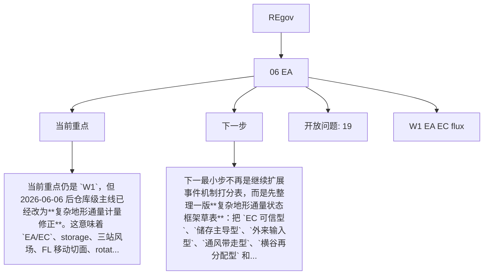

# REgov Workstream Dashboard

Generated: 2026-06-06 11:37:15

## Project Table

| Project | Status | Project memory | Workstreams | Open questions |
|---|---|---|---:|---:|
| 06 EA | ok | `D:\00 博士阶段\99 Project\06 EA\project_memory` | 1 | 19 |

## Workstream Details

### 06 EA

- Project memory: `D:\00 博士阶段\99 Project\06 EA\project_memory`
- Current focus:
  - 当前重点仍是 `W1`，但 2026-06-06 后仓库级主线已经改为**复杂地形通量计量修正**。这意味着 `EA/EC`、storage、三站风场、FL 移动切面、rotation 敏感性和 raw-w 诊断都应优...
- Next step:
  - 下一最小步不再是继续扩展事件机制打分表，而是先整理一版**复杂地形通量状态框架草表**：把 `EC 可信型`、`储存主导型`、`外来输入型`、`通风带走型`、`横谷再分配型` 和 `方法高不确定型` 逐一写出判别信号、...
- Workstreams:
  - `W1_EA_EC_flux.md`
    - 已新增并运行 `run_ea_preprocess.R`，输出主结果 `EA_flux_results.csv`、lag 配置与统计、despike 统计和运行日志。 [已核验: D:\00 博士阶段\博一\05 Pr...
    - 当前主结果共有 1152 行，覆盖 `2025-03-20` 到 `2025-03-23` 的 `MT`、`CVT`、`FL` 三个站点和 `co2`、`h2o` 两个标量。 [已核验: D:\00 博士阶段\博一\0...

