# REgov Workstream Dashboard

Generated: 2026-05-27 17:50:22

```mermaid
flowchart TD
  R["REgov"]
  R --> P0["Current"]
  P0 --> P0F["当前重点"]
  P0 --> P0N["下一步"]
  P0 --> P0Q["开放问题: 16"]
  P0F --> P0F0["当前重点仍是 `W1`。主线现在回到未修正 raw `w` CO2 总输送：旧 `EA_flux_results.csv` 保留为 \(w&#x27;\) 协方差型结果，新 raw-w 分..."]
  P0N --> P0N0["下一最小步应围绕 2026-05-26 收束出的两个方向做归因检验：一方面按风向扇区和事件 lead-lag 检查 CO2 次高峰是否由外来高 CO2 气团输入，并比较峰后下降更..."]
  P0 --> P0W0["W1 EA EC flux"]
  R --> P1["04 Lee"]
  P1 --> P1F["当前重点"]
  P1 --> P1N["下一步"]
  P1 --> P1Q["开放问题: 19"]
  P1F --> P1F0["当前真正推进中的重点，是 `W4` 这条与垂直平流和环流归因有关的工作线。现在的阶段已经从“是否存在 `09:00-11:00` 稳定或二次高峰”推进到“解释强弱事件背后的过程差..."]
  P1N --> P1N0["下一最小步已经从单个个例的高频追证转向多日事件普查。新的计算目录是 `D:\00 博士阶段\博一\05 Project\com_260507`，其 `DATA` 下已经有 `CV..."]
  P1 --> P1W0["W1 track section representativeness"]
  P1 --> P1W1["W2 lee method and fixed tower comparison"]
  P1 --> P1W2["W3 profile qc plotting and provenance"]
  P1 --> P1W3["W4 diurnal vertical advection and circulation"]
```

## Project Table

| Project | Status | Project memory | Workstreams | Open questions |
|---|---|---|---:|---:|
| Current | ok | `C:\Users\admin\Documents\New project\project_memory` | 1 | 16 |
| 04 Lee | ok | `D:\00 博士阶段\99 Project\04 Lee\project_memory` | 4 | 19 |

## Workstream Details

### Current

- Project memory: `C:\Users\admin\Documents\New project\project_memory`
- Current focus:
  - 当前重点仍是 `W1`。主线现在回到未修正 raw `w` CO2 总输送：旧 `EA_flux_results.csv` 保留为 \(w'\) 协方差型结果，新 raw-w 分支保留 5 min 与 30 min 两...
- Next step:
  - 下一最小步应围绕 2026-05-26 收束出的两个方向做归因检验：一方面按风向扇区和事件 lead-lag 检查 CO2 次高峰是否由外来高 CO2 气团输入，并比较峰后下降更像生态吸收、垂直混合稀释还是水平通风带走...
- Workstreams:
  - `W1_EA_EC_flux.md`
    - 已新增并运行 `run_ea_preprocess.R`，输出主结果 `EA_flux_results.csv`、lag 配置与统计、despike 统计和运行日志。 [已核验: D:\00 博士阶段\博一\05 Pr...
    - 当前主结果共有 1152 行，覆盖 `2025-03-20` 到 `2025-03-23` 的 `MT`、`CVT`、`FL` 三个站点和 `co2`、`h2o` 两个标量。 [已核验: D:\00 博士阶段\博一\0...

### 04 Lee

- Project memory: `D:\00 博士阶段\99 Project\04 Lee\project_memory`
- Current focus:
  - 当前真正推进中的重点，是 `W4` 这条与垂直平流和环流归因有关的工作线。现在的阶段已经从“是否存在 `09:00-11:00` 稳定或二次高峰”推进到“解释强弱事件背后的过程差异”。`process_contrast...
- Next step:
  - 下一最小步已经从单个个例的高频追证转向多日事件普查。新的计算目录是 `D:\00 博士阶段\博一\05 Project\com_260507`，其 `DATA` 下已经有 `CVT_AP`、`CVT_EC`、`CVT_...
- Workstreams:
  - `W1_track_section_representativeness.md`
    - 这条线最初的明确任务，是系统阅读老师已有 R 代码，梳理主要计算思想，并据此判断在复杂地形条件下，轨道断面能否被视为谷地输送平面的代表。 [来源: thread 019d27ef-6947-77c2-bd69-604c...
    - 讨论很快从“代码整体在做什么”推进到了更具体的问题，也就是夜间时段如何挑选、移动观测时段如何截取、流向坐标如何旋转，以及轨道节点如何划分。 [来源: thread 019d27ef-6947-77c2-bd69-604...
  - `W2_lee_method_and_fixed_tower_comparison.md`
    - 这条线一开始的明确任务，是详细阅读 `04_Fc_lee_corr.R`，并解释脚本逻辑。 [来源: thread 019d4c10-b36a-7d01-bc78-4796d0e6488c]
    - 在方法理解之外，这条线还承担了一个更实际的任务：帮助澄清老师所说的 valley-bottom 与 valley-edge 或 ridge-side 之间的比较，到底应该如何落实到当前数据与脚本结构上。 [来源: th...
  - `W3_profile_qc_plotting_and_provenance.md`
    - 这条线一开始的显式任务，是批量导入大量 profile 文件，生成按天命名的时序图，并修正日图命名、`delta_c` 面板和时区处理等细节。 [来源: thread 019d89ff-a2f8-7aa3-b6ef-3...
    - 同一条线后期又扩展到 `TIME_SERIES` 目录下所有脚本的检查与修改，特别是 `Asia/Shanghai` 时区解释、`0:00-24:00` 本地时间范围以及 `30 min` 分辨率的绘图规范。 [来源:...
  - `W4_diurnal_vertical_advection_and_circulation.md`
    - 这条线最初明确使用 `2025-03-20` 到 `2025-03-23` 作为示例窗口，目的是检查 `CVT` 和 `MT` 两塔冠层以上廓线以及垂直平流项的变化格局。 [来源: 用户提供的 2026-04-16 讨...
    - 初步讨论认为，最关键的变化时段集中在晨起和日落，尤其值得注意的是：两塔在 `06:00` 左右出现光合爆发、CO2 浓度下降，但在 `09:00` 左右又表现出浓度整体稳定甚至回升。 [来源: 用户提供的 2026-0...

