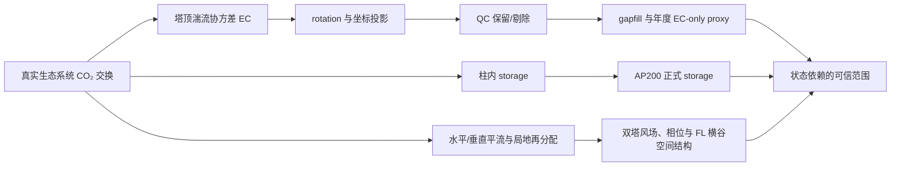

# 06EA 项目整体研究价值、博士论文主题与论文组合规划报告

**报告日期：** 2026-07-18  
**评估范围：** `06 EA` 项目仓库、D 盘项目记忆、E 盘正式/阶段性数据产品，以及截至 2026-07-18 可检索的相关研究进展。  
**结论置信度：** 项目进展与数值核验为高；机理解释为中等；完整平流修正与最终年度碳收支为低至中等，尚需关键验证。

**证据使用原则：** 根目录 README、项目快照和 dashboard 存在局部滞后或路径乱码；本报告以最新 E 盘实物、实际脚本/参数和专项核验记录为优先证据。

---

## 一、执行摘要

### 1. 对项目整体价值的直接判断

06EA 已经不再是“只有若干初步现象”的项目。观测条件和大部分处理链已经相当完备：两座地形位置不同的固定塔、两套 CO₂ 廓线、三维风和 EC 系统、横跨山谷的移动观测平台、统一的 Level0/Level1 数据结构、87 个项目脚本、6 个最小测试、96 条核验记录和 9 条正式研究路径。审计同时发现，部分被登记为“正式交付”的产品仍有配置或 QC 缺口，因此应把项目描述为 **数据资产成熟、若干关键产品待重新验收、科学综合尚未收束**。

本项目最强的整体科学命题不是“给复杂地形 EC 增加一个统一修正值”，而是：

> **复杂地形下 EC 对真实生态系统 CO₂ 交换的代表性具有状态依赖性；应根据湍流、储存、风场、空间浓度结构和方法敏感性，分别采取“直接采用、加入 storage、风险标记/范围约束”三类处理。**

这可以概括为一个 **screen–correct–bound（筛选—修正—约束）** 框架：

- **screen：** 识别 EC 可信状态和方法高风险状态；
- **correct：** 在局地柱定义成立时加入正式 storage；
- **bound：** 当平流、通风或局地再分配显著而控制体无法闭合时，不伪造一个“精确修正值”，而是用多塔、廓线和 FL 空间证据给出类型、方向和不确定性范围。

这一框架能把当前 W1、W2、W3 统一起来：W3 给出方法和年度传播误差，W1 提供 storage 与空间诊断，W2 把晨间边界层转换当作最清晰的自然实验来验证状态转换。

### 2. 最推荐的博士大论文主题

**推荐题目：复杂山地森林 CO₂ 交换的状态依赖观测偏差与多平台约束——从涡度相关测量到可信碳收支**

更偏方法的题目可写为：

**复杂地形下涡度相关碳通量的可信性诊断、储存修正与空间输送约束**

这一路线最能复用现有成果，也最不依赖尚未落实的大规模新观测。它允许最终成果不是单一“真值”，而是一套能够说明“何时可信、为何偏、如何修正、何时只能给范围”的方法体系。

### 3. 当前最接近投稿的成果

最接近完整小论文的是 **rotation–QC–gapfill 对 2025 年双塔 NEE proxy 的传播机制**。现有结果已经超过一般的“几种旋转方法对比”：

- 四种公共 rotation 下，MT 年值为 `-788.41` 至 `-1018.49 gC m^-2`，CVT 为 `-256.51` 至 `-533.55 gC m^-2`；
- MT 方法跨度 `230.08`、CVT `277.04 gC m^-2`，塔间差异跨度 `307.11 gC m^-2`；
- strict 条件下双塔共同 observed 窗口只占全年 `10.30–13.54%`，`any-gapfilled` 窗口贡献塔间年差异的 `76.67–88.64%`；
- 去掉 `qc/flag9` 后，共同 observed 覆盖升到 `55.99–57.92%`，gapfill 贡献降到 `31.80–43.59%`；
- 三方向协方差投影已在重算链内部严格闭合，能够解释 rotation 差异从何而来。

投稿前只需完成一个窄收尾：逐窗口解决重算结果与既有成品最大 `0.69–6.24` 的版本差异，并把现有诊断收束成一张因果解释矩阵。

### 4. 当前最大风险

1. **W3 不是最终碳收支。** storage、平流和代表性尚未进入公式，必须继续称为 `EC-only annual NEE estimate/proxy`。
2. **W2 当前固定规则使 usable days 与正幅度事件日近乎重合。** 现有季节和天气表描述的是“事件日内部构成”，还不能回答“什么条件提高事件发生概率”；必须建立数据可用但不满足事件形态的对照分母。
3. **FL 未完成全部三维平台运动修正。** 现有 PF/BPF 已处理水平运动和平均流面，但轨道坡度导致的垂直平台速度仍需实测或敏感性上界。
4. **FL 全量 BPF/PF 分支存在 6-bin/8-bin 配置错位。** 当前 `PF_8bin` 实际只拟合 6 个宽 bin；随后二集合并强制 8 bin，导致 7、8 bin 无参数，且前 6 个参数的空间边界被重新标号。全量 FL 的 no-rotation/DR 结果不受此问题影响，但 BPF/PF 结果和含该曲线的 pooled 图必须修复后重验。
5. **MT AP “after_qc” 仍全部是 warning。** `min_obs_per_level=3` 与实际 cycle 结构不匹配，使 623,854 个保留 cycle 的 `qc_flag_cycle` 全为 2；W2 的 MT 事件数必须在修正或论证该阈值后重新核验。
6. **正式 storage 尚未计算。** 当前 MT 最低层为 8 m，CVT 最低层为 24 m；尤其 CVT 缺少 0–24 m 柱信息，不能在没有外推假设或补充层位时称为完整 `0-z_r` storage。
7. **最小测试当前为 5/6 通过。** `tests/test_update_fl_complete_passes_incremental.R` 仍硬编码已不存在的 `E:/Dataset_RAW/.../02_mark_complete_passes_strict.R`，因此再现性测试失败；生产流程曾使用新路径跑通，但测试本身仍需更新后才能宣称 6/6。
7. **raw `w` 不能作为真实局地环流证明。** raw-w 总输送中平均流项占绝对分量约 `99.80–99.95%`，且可被水平风较大程度解释。

---

## 二、项目资源、研究结构与完成度

### 2.1 观测系统的独特性

项目位于复杂山地森林谷地，当前科学定义为：

- `MT`：谷缘高地固定塔；
- `CVT`：谷底固定塔；
- `FL`：沿横谷切面运动的平台；`0 m` 对应 MT/南侧，约 `122.5 m` 通过 CVT 正上方，`245 m` 为远端北侧；轨道方位约 `129.551°`。

两座固定塔能够提供地形位置对照；AP200 给出柱内 CO₂ 结构；FL 提供单塔缺失的横谷空间信息。这种“谷缘—谷底—移动切面”配置，明显强于常见的单塔 EC 项目。其价值不只是增加观测数量，而是让不同过程留下不同的可识别信号：

- storage 主要体现为同塔柱内浓度变化；
- 沿谷或横谷输入体现为站点 lead–lag、来流方向与来源侧浓度；
- 通风体现为风速增加、柱浓度下降及多站同步清除；
- 局地再分配体现为站点反相或 FL 偶极空间结构；
- 坐标/处理风险体现为 rotation 方法间离散、`w_mean` 对水平风的依赖和 PF 残差。

### 2.2 九条正式研究路径

| 路径 | 当前科学状态 | 已有成果 | 真正的下一门槛 |
|---|---|---|---|
| W1-P01 复杂地形通量状态框架 | 已定义范围 | rotation、raw-w、风场、FL、覆盖诊断齐全 | 完成“状态—信号—策略—证据缺口”表并验证 |
| W1-P02 FL 全量 BPF/EC 产品 | 部分可交付 | no-rotation/DR 与产品结构已落盘；BPF/PF 分支存在 6/8-bin 错位 | 显式固定 8 bin、重训、8/8 断言并重跑 PF 产品 |
| W1-P03 FL 空间约束 | 初步结果 | pass、位置热图、质量守恒、四天事件形态标签 | 跨事件验证重复性及风向/塔间相位一致性 |
| W1-P04 storage 修正 | 部分数据具备 | AP200 剖面基础和代理量；下部柱缺测 | 明确 0–最低层假设/补测，冻结控制体、单位和时间窗口 |
| W2-P01 2025 晨间 peak 气候学 | 初步分析 | 固定规则、强度分级、季节/天气分组、时序链 | 修正 MT AP QC，再人工复核并补建非事件对照分母 |
| W2-P02 peak 机制分类 | 已定义范围 | 四天 8 个事件 H1/H2/H3 证据链 | 锁定 20–30 个独立事件日并完成统一判据 |
| W2-P03 谷中央上空补充观测 | 依赖未来资源 | 目标样本和最低观测时段已定义 | 确定资源、位置和排期 |
| W3-P01 年度 NEE 交付 | 论文候选 | 四方法年值、塔差、图、30 min 明细 | 冻结 EC-only proxy 表述边界 |
| W3-P02 rotation–QC–gapfill 机制 | 分析进行中 | observed/gapfill、时段、风向、协方差投影诊断 | 解决窗口级版本差并收束解释矩阵 |

原始路径卡见[研究路径目录](</D:/00 博士阶段/99 Project/06 EA/project_memory/runtime/research_paths>)，阶段交付见[交付台账](</D:/00 博士阶段/99 Project/06 EA/project_memory/artifacts/02_deliverable_registry.md>)。

### 2.3 项目当前不是“缺数据”，而是“缺收束”

已有数据与产品足以支持多篇论文。继续无目标地增加同类图件，边际价值很低。当前最缺的不是新算法或大规模重写，而是：

1. 为每条路径冻结可证伪的主命题；
2. 把 observation、processing 和 mechanism 三类不确定性分开；
3. 给每个强结论设置验证门槛；
4. 把 W1/W2/W3 组织成同一个博士论文逻辑，而不是三个平行文件夹。

---

## 三、相关研究进展与 06EA 的位置

### 3.1 复杂地形 EC：研究前沿已从“是否有偏差”转向“何时有偏差以及如何量化不确定性”

EC 的平坦、均一、稳态和充分湍流假设早已明确；复杂地形下应考虑 storage、通量散度和平流也不是新观点。[Baldocchi 2003](https://doi.org/10.1046/j.1365-2486.2003.00629.x) 已系统说明这一边界。ADVEX 的多塔实验进一步证明，完整平流项具有强烈的三维性和场地依赖性，即使配置多塔也很难得到稳定闭合。[Feigenwinter et al. 2008](https://doi.org/10.1016/j.agrformet.2007.08.013)；[Montagnani et al. 2009](https://doi.org/10.1029/2008JD010650)。

因此近年的实际进展有三个方向：

1. **场地/状态特异的筛选与修正**，而不是寻找一个全球通用平流修正；
2. **多塔、廓线、footprint 或移动/航空平台提供空间约束**；
3. **传播不确定性**，把 rotation、筛选、gapfill 和空间代表性纳入结果范围。

直接物理加入垂直平流常会产生剧烈和不现实的通量；在瑞士陡坡森林，加入水平平流与 `u*` 筛选可得到较一致的季节结果，但垂直平流项高度不稳定。[Etzold et al. 2010](https://doi.org/10.5194/bg-7-2461-2010)。这支持 06EA 采用“可修正项明确修正、无法闭合项给风险和范围”的路线，而不是强行得到一个唯一真值。

### 3.2 坐标旋转：简单方法比较已不够，需解释其如何传播到累计碳收支

[Rannik et al. 2020](https://doi.org/10.1016/j.agrformet.2020.107940) 指出复杂站点的非零平均垂直风受风向、稳定度和时段控制，长期 PF 通常优于逐窗口 DR，但 sector-wise PF 在样本稀疏时也可能不稳定；未经水平平流约束的垂直平流不能直接改善夜间 NEE。2024 年研究开始用递归分区等方法自动寻找适当的 PF 分组边界，说明研究前沿正从“固定扇区”走向“数据支持的条件分组”。[On recursive partitioning to refine coordinate rotation, 2024](https://doi.org/10.1016/j.agrformet.2023.109873)。

06EA 的新意不应写成“比较了 no rotation、DR、PF、sector PF”，因为已有文献很多；应写成：

> **rotation 差异如何经协方差投影、QC 通过率和 gapfill 需求传播为年度 NEE 差异，并且这种传播为何在谷缘和谷底不同。**

现有三方向投影、严格/非严格 QC、共同窗口和 gapfilled-only 分解，使这一命题已经具有论文强度。

### 3.3 storage：直接相关研究已很成熟，单独“算 storage”创新不足

storage 是 EC 控制体内 CO₂ 库存随时间的变化。单点与多层廓线会给出明显不同的半小时结果；多点空间采样可以减少代表性偏差。[Nicolini et al. 2018](https://doi.org/10.1016/j.agrformet.2017.09.025)。ICOS 也已给出 profile storage 的标准化方法框架。[Montagnani et al. 2018](https://doi.org/10.1515/intag-2017-0037)。

2024 年复杂地形森林研究进一步表明，AP200 的顺序采样和 1–10 min CO₂ 波动会显著影响 storage 估计，storage 对 NEE 的贡献随湍流和地形复杂度可有很大变化。[Teng et al. 2024](https://doi.org/10.5194/amt-17-5581-2024)。这与 06EA 的仪器和场景高度可比。

因此 W1-P04 若只完成 `F_storage` 计算，属于必要工作但论文创新有限。更强的方向是：

- 比较多时间窗口、profile 与 top-point 的抽样不确定性；
- 比较谷底与谷缘的 storage 状态及其晨间相位；
- 检验 `EC + storage` 后剩余偏差是否与 FL 空间形态、风向和站点 lead–lag 一致；
- 将 storage 作为状态分类中唯一可直接物理修正的分支。

### 3.4 多塔和风场：不能预设“典型热力环流”

2025 年三塔山地森林研究显示，真实风场可能受背景天气流控制，并不总表现为教科书式日间上坡、夜间下坡环流；不同塔还会有明显的冠层上下风向解耦。[Gao et al. 2025](https://doi.org/10.1016/j.agrformet.2025.110545)。2026 年同类研究进一步采用风向扇区特异的 `u*` 阈值和 gapfill 策略，说明地形敏感的 QC 已成为现实研究方向。[Li et al. 2026](https://doi.org/10.1007/s11430-024-1723-y)。

这对 06EA 有两个直接约束：

1. 不能把 `MT/FL` 上升、`CVT` 下沉的 raw-w 图像直接命名为闭合次级环流；
2. 状态框架必须同时容纳热力局地环流和背景天气流控制，风向扇区是条件变量，不是预设机制。

### 3.5 年度 NEE 与 gapfill：最新研究强调长缺口和不确定性校准

ONEFlux 通过多个 `u*` 阈值 realization、MDS gapfill 和随机误差估计来传播 NEE 不确定性，而不是只发布一条完整曲线。[Pastorello et al. 2020](https://www.nature.com/articles/s41597-020-0534-3)。近年研究发现，标准 MDS 在部分场地会产生系统偏差，且对长缺口的不确定性常被低估。[Vekuri et al. 2023](https://www.nature.com/articles/s41598-023-28827-2)；[Improved uncertainty estimates using deep ensembles, 2025](https://doi.org/10.1016/j.agrformet.2025.110558)。对超过 30 天的缺口，机器学习可能优于 MDS，但这并不意味着 06EA 必须另造复杂模型；更重要的是先用 block masking 证明当前 gapfill 在本场地的误差边界。[Robust filling of extra-long gaps, 2025](https://doi.org/10.1016/j.agrformet.2025.110438)。

由于 06EA strict 年值中多数半小时由 gapfill 产生，年度绝对值不适合被包装成精确碳汇估计。但这反而形成了一个有价值的问题：**QC 如何制造缺口、缺口如何被 gapfill 放大、rotation 又如何改变被保留的观测分布。**

### 3.6 晨间边界层转换：热点是多尺度和非局地过程，而非单点峰值

山谷晨间转换受冷池消散、坡面加热、水平热平流、背景风和阴影差异共同控制。[Fritz et al. 2021](https://doi.org/10.1029/2020GL092238) 的高分辨率观测显示，水平热平流可与地表加热共同驱动山地边界层转换；2023 年坡面研究也表明，不同天气状态下转换可从地表向上发展，也可由上层湍流向下传播。[Characterization of the Morning Transition, 2023](https://doi.org/10.1175/JAMC-D-22-0011.1)。

因此 W2 的优势不是“发现早晨 CO₂ 会升高”，而是：

- 有一个自然年的双塔廓线事件目录；
- 有谷底—谷缘的相位和强度比较；
- 有风向、风速、温度梯度与 EC 协变量；
- 有 FL 横谷空间结构；
- 能把边界层转换、外来输入、局地再分配和峰后通风作为竞争假说。

### 3.7 移动平台与空间异质性：方向正确，但必须把“空间约束”和“通量真值”分开

近年来，重复低成本 EC 阵列、航空 EC、UAV 浓度/风场与 LES 联合反演都在解决单塔空间代表性不足。[Cunliffe et al. 2022](https://doi.org/10.1029/2021JG006240)；[UAV-based in situ CO₂ and CH₄ fluxes, 2024](https://doi.org/10.5194/amt-17-5619-2024)；[UAV mixing ratios + LES + EC, 2025](https://doi.org/10.5194/amt-18-6917-2025)。

06EA 的轨道式重复横谷切面具有稀缺性，但其最稳健用途是识别同步、单侧增强、谷底增强、偶极结构及通风清除，而不是把每个 pass 直接解释为地表生态通量。项目现有解释边界是正确的，应继续保持。

---

## 四、各研究路径的详细价值评估

## 4.1 W1：复杂地形通量计量与 FL 空间约束

### W1-P01 复杂地形通量状态框架

**当前基础。** rotation、raw-w、三站风、廓线、FL 和 W3 年度诊断均已存在，但尚未形成统一决策规则。

**价值。** 这是最适合作为博士论文总框架的路径。文献已经证明完整平流难测、单一 `u*` 或单一 PF 并非普适；项目可以把多源观测转化为状态依赖的置信策略。

**建议的最小状态集：**

| 状态 | 主要信号 | 推荐处理 | 当前证据 |
|---|---|---|---|
| EC 可信型 | 充分湍流、rotation spread 小、柱变化小、站点/FL 无强梯度 | 报告 EC 与常规随机误差 | 有 rotation 和气象基础，待定阈值 |
| storage 主导型 | 柱 CO₂ tendency 大、水平输入证据弱 | `EC + formal storage` | AP 剖面有基础；MT QC 与下部柱几何待验 |
| 外来输入型 | 上风站/来源侧先升、风向对齐、来源侧 CO₂ 较高 | EC 保留但加 advection-risk；不给虚假精确修正 | 四天事件有部分支持 |
| 通风带走型 | 峰后风速增强、柱浓度下降、多站同步清除 | 标记控制体输出，分析下降速率 | W2 有过程变量，待批量验证 |
| 横谷再分配型 | 双塔反相/稳定相位差、FL 偶极或单侧结构 | 使用空间约束，不作为区域净交换 | FL 四天标签为初步证据 |
| 方法高风险型 | rotation 年/窗差异大、`w_mean` 被水平风解释、PF 样本不足 | 多方法 ensemble 或剔除，不给单方法结论 | 证据最充分 |

**必须避免。** 状态分类不能只靠同一组变量定义后再用同一组变量“验证”。应保留独立验证量，例如 withheld 事件日、人工形态标签、来源侧浓度或补充上空观测。

### W1-P02 FL 全量 BPF 与 EC 产品

**当前状态：部分完成，必须拆分三条处理链。**

- **全量 no-rotation/DR：可继续使用。** 三组 source group 的 30 min 产品已落盘，重复 timestamp 均为 0；这两条分支不依赖当前错误的 BPF 参数。
- **全量 multicaliber BPF/PF：当前无效，待修复重跑。** `run_fl_multicaliber_bpf_training.R` 未显式设置 `cfg$n_bins <- 8L`；读取默认配置时，R 的 `$` 部分匹配使 `cfg$n_bins` 实际取得 `n_bins_set` 的第一个值 `6`。因此当前 `PF_8bin/pf_fit_summary.csv` 只有 6 个宽 bin；随后二集合并强制按 8 bin 输出，7、8 bin 为 `fit_ok = FALSE`，前 6 个参数的空间边界也被错误重标。当前全量 PF 30 min 产品、BPF 默认参数以及含 PF 曲线的 pooled 图均不得作为正式结果。
- **旧质量守恒分支：不受该 bug 影响。** 它使用 `E:/Dataset_Level1/Flares/PFparameter_2ensemble/PF_8bin_2ensemble_parameters_for_flux.csv`，8/8 bin 均 `fit_ok = TRUE`；`2933` 个严格 pass、`2868` 个可计算、`2789` 个成功闭合 mixed-sign pass 只属于这条旧分支，不能反证当前 multicaliber BPF/PF 有效。核验见[旧质量守恒记录](</D:/00 博士阶段/99 Project/06 EA/project_memory/evidence/verifications/2026-06-20_fl_mass_balance_pf8bin_2ensemble.md>)和[E 盘 verification summary](</E:/FL_MASSBALANCE/qc/verification_summary.txt>)。

**价值与验收门槛。** 这仍是论文和博士工作的基础设施，但不应再把“文件已生成”写成科学完成。必须显式固定 8 bin、重训并断言两级参数均为 8/8 `fit_ok`，再重跑全量 PF 产品和 pooled 图。通过后仍需评估轨道坡度造成的垂直平台速度上界，并判断其相对 `w_pf`、协方差和空间形态的量级。

### W1-P03 FL 空间结构约束

**当前结果。** 四天 feasibility 中有 `193` 个 pass；`non_lambda_extreme` 与全样本空间 profile 相关 `0.821`，但 `non_air_imbalance` 仅 `0.228`。正式标签显示部分日期为“两端强、中部弱”，部分事件在 CVT 对应位置出现偶极结构；这些结果支持空间非均匀和候选再分配，但不证明闭合次级环流。

**论文潜力。** 高，但必须以事件日为独立样本，并回答“形态是否跨事件重复、是否与风向和两塔相位一致”。仅展示一张漂亮的 position–time 热图不够。

**最小补实验。** 对人工复核后的 20–30 个事件日：

1. 预定义 `uniform / source-side enhanced / valley-center enhanced / dipole / ventilation-cleared` 五类标签；
2. 同时给出 fw/bw 一致性、pass bootstrap 和日期 bootstrap；
3. 检验标签与来流方向、双塔 peak lag、柱 tendency 的一致性；
4. 将 `extreme_forced` 和 single-sign 结果保留为方法风险层，不混入主物理结论。

### W1-P04 正式 storage 修正

**当前状态：剖面基础已落盘，但 QC 和控制体几何均未正式验收。** MT 层位为 `8/13/17/20/29.5 m`，CVT 为 `24/32/43 m`。MT 当前设置 `min_obs_per_level = 3`，而实际保留轮次各层 `qc_level_n = 2`；因此 `after_qc` 中 623,854 个保留 cycle 的 `qc_flag_cycle` 全为 2，现有 MT `after_qc` 是 warning 集而不是 clean 子集。CVT 的 cycle 分布为 flag0 `371,596`、flag1 `8,551`、flag2 `17,098`、flag3 `4,185`，其 QC 结构没有同样的全体 warning 问题。

现有层位也不能直接覆盖完整 `0-z_r` 柱：MT 缺少 `0–8 m`，CVT 缺少 `0–24 m`；尤其 CVT 最低观测层 `24 m` 已高于约 `20 m` 林冠，当前 tendency 最多只能称为**上部柱 proxy**。正式 storage 必须预先定义下部柱外推、补充低层观测或多方案敏感性范围。

**价值判断。** storage 是博士主线不可缺少的一章，但不宜单独以“首次计算”为主要创新。真正值得发表的是 storage 抽样不确定性、谷缘/谷底差异，以及它对 EC 可信状态和晨间事件的解释增量。

**最小补实验顺序。**

1. 修正或论证 MT `min_obs_per_level`，重跑后确认 QC 分布不再由结构性阈值强制为全体 warning；
2. 冻结 MT `0–8 m`、CVT `0–24 m` 的处理方案，并用外推/补测/上下界情景报告敏感性；
3. 在 4 天典型窗口验证干空气摩尔密度、层厚权重、时间标记和符号；
4. 比较 2/4/8/16/30 min averaging window，以及 profile 与 EC 高度 single-point approximation；
5. 扩展至 2025，报告半小时和日/季累计误差，再检验 `EC + storage` 后 residual 与 FL/风场状态的关系。

## 4.2 W2：晨间 CO₂ peak 气候学与机制

### W2-P01 2025 事件气候学

**当前为候选目录，不是正式气候学。** 固定规则下，CVT 有 `199` 个 usable/event days、`>=5 ppm` 为 `83`、`>=10 ppm` 为 `42`；MT 对应的 `182/72/34` 以及任一涉及 MT 的双塔统计，均是 **MT AP 阈值复核前的候选值**。当前任一塔正幅度事件为候选 `229` 天、双塔同时事件为候选 `152` 天。输出还包括 0–3、3–10、>=10 ppm 强度分级、季节与天气分组、时序链和双塔 lag。

MT 候选目录由上述全体 `qc_flag_cycle = 2` 的 `after_qc` 构建，因此本节所有涉及 MT 或双塔配对的数字都只能用于定位和人工复核，不能进入正式发生率、站点差异或机制结论。

当前数据给出几个有价值但必须谨慎的信号：

- 双塔同时事件中，121/152 天为同强度等级，31 天为混合等级；
- 双塔 pre-min 和 peak lag 的中位数均为 `0 min`，显示半小时尺度上高度同步；
- profile switch 可判定子集内，CVT/MT 相对 peak 的中位提前量约 `120/150 min`；
- 秋季强事件比例较高：CVT 为 `22/51`，MT 为 `16/38`；
- MT 高风速组的强事件构成明显较高，但 CVT 的风速关系较弱。

**关键统计问题。** 项目运行说明已经明确：固定 shape rule 使 usable days 实际上与 `amp>0` event days 重合。因此上述季节/天气表只能描述“事件日内部强弱构成”，不能估计事件发生概率或做 event vs non-event 驱动分析。

**必须补的最小实验。**

1. 先定义 `data_eligible_day`：日出前后数据完整、AP 层位和 sunrise proxy 可用；
2. 再将其分为 `pattern_event / eligible_non_event / insufficient_data`；
3. 人工复核全部 `amp>5 ppm`，并抽查低幅度与非事件日估计假阴性；
4. 以日期为独立样本，用分层 logistic/ordinal 模型检验季节、风速、温度梯度和辐射；
5. 使用按季节或连续日期分块的 holdout，避免同一规则在同一年内自我验证。

修正 MT AP QC、重跑候选目录并完成上述检验后，W2-P01 才可以独立形成事件气候学论文。

### W2-P02 机制分类

**当前证据。** 四天 8 个事件中，profile transition 均早于 peak，是目前最稳定的先导信号；多数事件峰前有风速增强、转向或 FL 异常，但来源侧高 CO₂ 只在部分事件得到支持。湍流、`sigma_w`、`u*` 和感热峰值多出现在近峰或峰后，不能作为统一触发因子。

**科学含义。** 当前最合理的解释不是单机制，而是顺序过程：

1. 夜间储存和稳定廓线形成初始条件；
2. 晨间 profile transition 改变柱结构；
3. 风向/风速变化决定外来输入或局地再分配是否叠加；
4. 峰后下降由吸收、混合稀释和通风共同控制。

**下一步。** 从正式复核目录选择 20–30 个事件日，保证覆盖弱风晴空、峰前增风/转向、较强通风三类状态。每个事件日形成一行机制矩阵，而不是把 30 min 点当作独立样本。

### W2-P03 补充观测

这条路径不是当前分析的前置条件，但会显著提升 W2-P02 的因果强度。建议安排 16–20 个晨间观测窗口，目标获得 12–15 个有效事件；每次覆盖日出前 1 h 至 peak 后 2–3 h。最低变量集应为固定高度 CO₂、三维风、温湿压、辐射和与两塔统一的时间基准。若资源有限，优先固定上空观测，不必同时扩展复杂仪器阵列。

## 4.3 W3：年度 NEE proxy 与误差传播

### W3-P01 年度交付

公共四方法 strict 年值已经是正式论文候选产品：

| 站点 | no rotation | DR | global PF | sector PF | 方法跨度 |
|---|---:|---:|---:|---:|---:|
| MT | -788.41 | -883.52 | -1018.49 | -919.92 | 230.08 |
| CVT | -261.19 | -256.51 | -325.02 | -533.55 | 277.04 |

单位均为 `gC m^-2 yr^-1` 的 EC-only estimate。原始汇总见[公共四方法表](</E:/Dataset_Level1/FixedTower/EC/rotation_sensitivity_standardized_2025/rotation_sensitivity_standardized_2025_common_four_methods_summary.csv>)。

这些数值足以说明方法敏感性，但不适合直接回答“研究区真实碳汇是多少”。正确写法应是：**在当前 EC-only 处理链下，不同 rotation 与筛选/gapfill 组合给出的年度净吸收范围。**

### W3-P02 rotation–QC–gapfill 机制

这是当前最强的小论文方向。其核心发现不是“gapfill 很多”，而是：

- strict QC 把单塔 observed valid 比例压到 MT `31–34%`、CVT `22–27%`；
- 关闭 `qc/flag9` 后分别升到约 `73–77%` 和 `67–68%`；
- 共同 observed 覆盖下降使 gapfill 主导塔间累计差异；
- 白天 10:00–18:00 是塔间差异的主要来源，但具体比例随方法和 QC 变化；
- rotation 对 `w_mean` 的影响远大于对 `sigma_w` 的影响，说明差异主要来自坐标投影而不是湍流强度被整体改变；
- 核心窗口中原始垂直协方差、rotation 调整和后协方差残差对塔间差异的贡献约为 `75.72% / 16.84% / 7.44%`；
- MT 目标来流扇区与净辐射和不稳定层结明显相关，更像局地日间热力状态而非多日背景天气事件。

**投稿前必须完成：**

1. 对 preflight top windows 逐条锁定原始文件、PF 参数和后处理版本；
2. 保证所有主图来自同一冻结版本；
3. 将 strict/no-QC、observed/gapfilled、hour/sector、projection/source 整理为一张因果链图和一张结果矩阵；
4. 用日期 block bootstrap 报告塔间差异置信区间；
5. 用人为遮挡的 1/3/7/30 天 gap 做最小 gapfill 误差检查，不必先开发新模型。

---

## 五、项目整体科学价值

### 5.1 最强价值：同一控制问题的多尺度观测闭环

项目不是简单地“数据多”，而是每一类观测回答不同的质量守恒项：

这使 06EA 有机会从“某场地的碳通量结果”提升为“复杂地形下如何判断碳通量可信性”的方法框架。

### 5.2 第二强价值：晨间 peak 是验证框架的自然实验

晨间转换把 storage、稳定层结、风场转变、局地环流和生态吸收压缩在数小时内。相比直接在全年数据中寻找相关性，事件日能够观察过程顺序，因此更适合验证状态分类。W2 不应与大论文主线分离；它可以作为状态框架的过程验证章节。

### 5.3 第三强价值：方法误差已被量化到年度尺度

很多 rotation 论文停留在半小时通量或均值差异；06EA 已经把方法差异传播到年值、塔间差、QC 通过率、gapfilled-only 贡献和协方差投影来源。这是最可立即转化为论文的部分。

### 5.4 项目当前不能支持的结论

- 不能给出“研究区最终 NECB”或唯一真实年碳汇；
- 不能把 raw `wc` 或 `w_mean` 写成生态系统净交换；
- 不能把 FL 当第三座固定平均通量塔；
- 不能宣称已直接测得完整水平和垂直平流闭合；
- 不能把四天空间结构推广为全年普遍环流；
- 不能把当前 W2 季节/天气构成写成事件发生概率控制；
- 不能使用当前全量 multicaliber PF 产品或 pooled PF 曲线支持正式 FL 结论；
- 不能把当前 MT `after_qc` 当作 clean 子集，或把基于它的 MT/W2 数字当作正式气候学结果；
- 不能把 EA 条件积分包装成独立于 EC 的新通量估计器，因为当前实现与协方差在数值上等价。

---

## 六、可形成博士大论文的三个主题

## 主题 A：状态依赖的复杂地形碳通量可信性框架（首选）

**建议题目：** 复杂山地森林 CO₂ 交换的状态依赖观测偏差与多平台约束——从涡度相关测量到可信碳收支

**核心问题：**

1. 哪些流动与环境状态下 EC 仍可作为生态交换参照？
2. storage 能修正多少夜间和晨间偏差？
3. 哪些 residual 更像外来输入、通风或横谷再分配？
4. rotation、QC 和 gapfill 如何传播为年度结果不确定性？
5. 多塔、廓线和移动切面能否形成可迁移的状态判据？

**建议章节：**

1. 研究区、多平台观测与统一处理链；
2. rotation–QC–gapfill 对双塔 EC-only 年度 NEE 的误差传播；
3. 双塔局地柱 storage 的正式估计及抽样不确定性；
4. FL 横谷移动切面的空间异质性和输送风险约束；
5. 晨间 CO₂ peak 的事件气候学与状态转换机制；
6. screen–correct–bound 状态框架、验证与年度可信范围。

**优点：** 最大限度复用现有结果；即使补充观测延迟，也能靠现有数据完成主体；方法与过程兼具。  
**风险：** 若状态框架没有独立验证，会变成经验分类表。  
**解决办法：** 预注册判据、事件日 holdout、日期 block bootstrap，并将无法验证的状态保留为风险标记而非修正值。

## 主题 B：山谷晨间边界层转换与 CO₂ 再分配机制

**建议题目：** 山地森林谷地晨间边界层转换驱动的 CO₂ 储存释放、空间传播与局地再分配

**核心问题：** 晨间 secondary peak 是柱内 storage 重分配、水平输入、局地环流，还是多过程组合？其季节性和天气依赖如何？

**建议章节：** 2025 事件气候学；双塔相位和廓线转换；20–30 个事件机制分类；FL 横谷空间形态；谷中央上空补充观测；竞争假说与过程模型。

**优点：** 过程故事强，容易形成清晰图像；与边界层气象学衔接好。  
**风险：** 对新观测依赖更高；如果只用一个自然年和自动事件规则，博士论文广度不足。  
**适用条件：** 能落实至少 12–15 个有效上空观测晨，并完成非事件对照和事件日独立验证。

## 主题 C：复杂地形多平台 EC 方法不确定性与空间代表性

**建议题目：** 复杂地形固定塔与移动平台 CO₂ 通量观测的方法不确定性、空间代表性及尺度衔接

**核心问题：** rotation、移动平台校正、footprint/空间异质性、QC 和 gapfill 如何共同决定长期碳通量估计？

**优点：** 现有数据产品最成熟，技术风险较低；可形成 AMT/AFM 风格的方法论文组合。  
**风险：** 容易过于工程化，生态/边界层科学问题不足。  
**解决办法：** 必须保留一个过程章节，例如晨间转换或热力来流状态，证明方法差异对应真实流动状态而非纯软件差异。

### 推荐顺序

1. **主题 A：首选，综合价值最高。**
2. **主题 B：若补充观测能落实，可成为更偏边界层机理的替代方案。**
3. **主题 C：若时间或外场资源受限，是最稳妥的完成方案。**

---

## 七、可形成小论文的主题与优先级

| 优先级 | 论文主题 | 当前成熟度 | 最小补充实验 | 适合期刊方向 |
|---|---|---:|---|---|
| P0 | rotation–QC–gapfill 如何传播为双塔年度 NEE 差异 | 85% | 解决 top windows 版本差；block bootstrap；最小 gap masking | Agricultural and Forest Meteorology；AMT |
| P0 | 2025 双塔晨间 CO₂ peak 事件气候学与时序链 | 55% | 先修 MT AP QC 并重跑；人工复核；建立 eligible non-event；holdout 验证 | Boundary-Layer Meteorology；ACP；Biogeosciences |
| P1 | 双塔 profile storage 的抽样不确定性和状态依赖修正 | 35% | 修 MT QC；定义下部柱；多时间窗口；profile vs single-point | AMT；Agricultural and Forest Meteorology |
| P1 | 横谷移动切面的重复空间结构及其对单塔代表性的约束 | 40% | 先修复 BPF/PF；垂直平台运动上界；20–30 事件标签；日期 bootstrap | AMT；Agricultural and Forest Meteorology |
| P1 | 晨间 peak 的竞争机制：storage、外来输入和通风 | 40% | 20–30 独立事件日；三类天气覆盖；统一证据矩阵 | ACP；Boundary-Layer Meteorology |
| P2 | 状态依赖的 EC screen–correct–bound 框架 | 35% | 前述论文结果整合；独立验证；年度不确定性范围 | Biogeosciences；Agricultural and Forest Meteorology |
| P2 | FL BPF/多旋转数据产品或方法说明 | 35–40%（待修复） | 固定 8 bin、8/8 断言并重跑全量 PF 产品；再补 metadata 与不确定性 | AMT；ESSD（需开放数据） |

### 小论文 1：最优先投稿

**拟题：** *Propagation of coordinate rotation, quality control and gap filling into annual CO₂ balance estimates at two contrasting positions in complex terrain*

**主结论结构：**

1. rotation 改变的不只是 `w_mean`，还改变 covariance projection 和 QC 保留样本；
2. QC 造成的缺口结构决定 gapfill 对年度塔差的贡献；
3. 谷缘与谷底的敏感性不同，并集中于特定时段和来流状态；
4. 因此年度差异应报告为处理链 ensemble，而不是单方法真值。

这篇论文应避免再扩展到 storage 或晨间 peak，以保持问题单一。

### 小论文 2：晨间事件气候学

**拟题：** *Climatology and timing chain of recurrent morning CO₂ recovery events across valley-floor and valley-edge forest towers*

核心是“事件是否稳定、何时发生、两塔是否同步、强度如何分级、哪些状态提高发生概率”。当前季节/天气构成图可以保留，但必须补 non-event denominator 后再做发生概率分析。

### 小论文 3：storage

**拟题：** *Sampling uncertainty and state dependence of profile-based CO₂ storage fluxes at contrasting topographic positions*

应突出 AP 顺序采样、多时间窗口和谷底/谷缘差异，避免与 2024 年 storage 研究重复。最有辨识度的结果是 storage 对晨间事件和 EC residual 的解释增量。

### 小论文 4：FL 空间约束

**拟题：** *Repeated mobile cross-valley observations reveal spatial states hidden from fixed-tower CO₂ flux measurements*

主结果应是空间状态、重复性和对单塔解释的增量，不应以 `F_lambda` 绝对量作为生态系统通量真值。

### 小论文 5：机制整合

**拟题：** *Competing pathways of recurrent morning CO₂ peaks in a forested mountain valley: storage transition, advective input and ventilation*

这篇应在事件气候学之后完成。每个事件日输出机制分数或证据等级，并明确“支持、反对、信息不足”，而不是强行给每一天唯一标签。

---

## 八、建议执行路线与验收门槛

### 阶段 0：修复验收门槛

**任务：** 在任何依赖产品进入论文主结果前，先修复四个可复现性阻断项：FL BPF 6/8-bin 配置、MT AP QC 结构性阈值、storage 下部柱几何假设，以及增量测试中的陈旧 `E:/Dataset_RAW/...` 路径。  
**验收：** FL `PF_8bin` 与二集合并参数均为 8/8 `fit_ok`，全量 PF 产品和 pooled 图已重跑；MT QC 不再被样本结构强制为全体 warning，W2 MT 候选已重建；MT `0–8 m` 与 CVT `0–24 m` 有明确方案和敏感性范围；6 个最小测试全部通过。

### 阶段 1：先封口最成熟论文

**任务：** 完成 W3 rotation–QC–gapfill 论文。  
**只做：** top windows 版本核对、统一冻结输入、日期 block bootstrap、解释矩阵和论文图。  
**不做：** 此时不再引入新的 rotation 家族或复杂 ML gapfill。  
**验收：** 所有主图同一版本；累计闭合；结论能区分 observation、QC、gapfill 和 projection 四层。

### 阶段 2：把 W2 从“候选表”变成正式事件目录

**任务：** 人工复核 `amp>5 ppm`，抽查低幅度和 non-event；重建 data-eligible denominator。  
**验收：** 有正式事件目录、排除原因、假阳性/假阴性估计、事件与非事件的独立比较。

### 阶段 3：完成正式 storage

**任务：** 先做四天和 1 个月小窗口，验证单位、时间和 sampling-window 敏感性，再扩展 2025。  
**验收：** profile 与 single-point 差异清楚；半小时与日累计不确定性可报告；`EC + storage` 的边界明确。

### 阶段 4：用事件日组织 FL，而不是继续画全年平均图

**任务：** 对 20–30 个事件日生成空间标签、fw/bw 稳健性、日期 bootstrap 和双塔相位对照。  
**验收：** 至少一种空间状态跨多个独立日期重复，并与风向/塔间相位有一致关系。

### 阶段 5：整合状态框架

**任务：** 冻结状态定义和处理策略，在 withheld 事件或日期上验证。  
**验收：** 能明确回答三个问题：

1. 什么时候 EC 可直接解释？
2. 什么时候加入 storage 后解释明显改善？
3. 什么时候只能给平流/空间风险与不确定性范围？

---

## 九、最终建议

### 9.1 应保留并强化的主线

- 保留 W1、W2、W3，但将其统一到“状态依赖的测量可信性”之下；
- 先完成阶段 0，再让 FL PF、MT 廓线和 storage 进入论文主结果；
- 以 W3 方法误差论文作为近期第一成果；
- 以正式 storage 和 W2 事件目录作为大论文的两个关键补口；
- 让 FL 专门承担空间约束，不再承担“第三固定塔”的叙述压力。

### 9.2 应降级或停止扩展的方向

- EA 与 EC 数值等价的部分不单独包装成新方法论文；
- raw-w 继续作为诊断，不加入最终碳收支；
- 经验 tilt correction 无实测几何支撑，继续暂停；
- 暂停使用当前全量 multicaliber PF 分支、BPF 默认参数及 pooled PF 曲线作为正式结论，直至 8/8 重训和全量重跑验收；
- 暂停使用当前 MT `after_qc` 及其派生 W2 MT/双塔统计作为正式结论，直至阈值修正或充分论证并重跑；
- 不再为相同问题新增同类日变化图；
- 不在正式 storage 前宣称控制体闭合；
- 不为追求“高级”而先上复杂机器学习，除非 block masking 证明现有 gapfill 确实不足。

### 9.3 一句话路线

> **先用 W3 证明“方法选择会改变年度答案”，再用 storage 和晨间事件解释“何时以及为什么改变”，最后用 FL 和多塔证据构建“遇到不同状态应该如何报告”的博士论文框架。**

---

## 十、主要参考文献与研究进展来源

1. [Baldocchi, 2003. Assessing the eddy covariance technique for evaluating carbon dioxide exchange rates of ecosystems](https://doi.org/10.1046/j.1365-2486.2003.00629.x)
2. [Feigenwinter et al., 2008. Comparison of horizontal and vertical advective CO₂ fluxes at three forest sites](https://doi.org/10.1016/j.agrformet.2007.08.013)
3. [Montagnani et al., 2009. A new mass conservation approach to the study of CO₂ advection in an alpine forest](https://doi.org/10.1029/2008JD010650)
4. [Etzold et al., 2010. Contribution of advection to the carbon budget measured by EC at a steep mountain slope forest](https://doi.org/10.5194/bg-7-2461-2010)
5. [Nicolini et al., 2018. Impact of CO₂ storage flux sampling uncertainty on NEE](https://doi.org/10.1016/j.agrformet.2017.09.025)
6. [Montagnani et al., 2018. Estimating the storage term in eddy covariance measurements: the ICOS methodology](https://doi.org/10.1515/intag-2017-0037)
7. [Kang et al., 2017. Identifying CO₂ advection on a hill slope using information flow](https://doi.org/10.1016/j.agrformet.2016.08.003)
8. [Kang et al., 2019. Modification of the moving point test for nighttime EC filtering on complex terrain](https://pmc.ncbi.nlm.nih.gov/articles/PMC6541885/)
9. [Rannik et al., 2020. Impact of coordinate rotation on eddy covariance fluxes at complex sites](https://doi.org/10.1016/j.agrformet.2020.107940)
10. [On recursive partitioning to refine coordinate rotation in EC applications, 2024](https://doi.org/10.1016/j.agrformet.2023.109873)
11. [Teng et al., 2024. CO₂ fluctuations and complex-terrain flows in storage/NEE estimation](https://doi.org/10.5194/amt-17-5581-2024)
12. [Gao et al., 2025. Wind regimes and their drivers in mountainous forests](https://doi.org/10.1016/j.agrformet.2025.110545)
13. [Li et al., 2026. Filtering and gap-filling strategies in mountainous forests](https://doi.org/10.1007/s11430-024-1723-y)
14. [Pastorello et al., 2020. FLUXNET2015 and the ONEFlux processing pipeline](https://www.nature.com/articles/s41597-020-0534-3)
15. [Vekuri et al., 2023. A widely used EC gap-filling method creates systematic bias](https://www.nature.com/articles/s41598-023-28827-2)
16. [Stable gap-filling for longer EC gaps, 2022](https://doi.org/10.1016/j.agrformet.2021.108777)
17. [Robust filling of extra-long EC CO₂ gaps, 2025](https://doi.org/10.1016/j.agrformet.2025.110438)
18. [Improved uncertainty estimates for EC carbon balances using deep ensembles, 2025](https://doi.org/10.1016/j.agrformet.2025.110558)
19. [Fritz et al., 2021. Revealing the morning transition in the mountain boundary layer](https://doi.org/10.1029/2020GL092238)
20. [Characterization of the morning transition over a gentle slope, 2023](https://doi.org/10.1175/JAMC-D-22-0011.1)
21. [Rotach et al., 2015. Vertical exchange over complex mountainous terrain](https://doi.org/10.3389/feart.2015.00076)
22. [Cunliffe et al., 2022. Replicated EC systems and landscape heterogeneity](https://doi.org/10.1029/2021JG006240)
23. [UAV-based in situ measurements of CO₂ and CH₄ fluxes, 2024](https://doi.org/10.5194/amt-17-5619-2024)
24. [UAV mixing ratios coupled with LES and EC over heterogeneous landscapes, 2025](https://doi.org/10.5194/amt-18-6917-2025)
25. [Xiao et al., 2026. Insights from the global eddy covariance network](https://www.nature.com/articles/s43017-025-00743-1)

---

## 十一、内部核验入口

- [项目当前快照](</D:/00 博士阶段/99 Project/06 EA/project_memory/runtime/01_current_snapshot.md>)
- [下一步主线任务](</D:/00 博士阶段/99 Project/06 EA/project_memory/runtime/05_next_mainline_tasks.md>)
- [W1 工作流](</D:/00 博士阶段/99 Project/06 EA/project_memory/workstreams/W1_EA_EC_flux.md>)
- [W2 工作流](</D:/00 博士阶段/99 Project/06 EA/project_memory/workstreams/W2_morning_peak_workflow.md>)
- [W3 工作流](</D:/00 博士阶段/99 Project/06 EA/project_memory/workstreams/W3_fixed_tower_annual_nee_estimation.md>)
- [当前生效决策](</D:/00 博士阶段/99 Project/06 EA/project_memory/anchors/03_active_decisions.md>)
- [冲突与风险记录](</D:/00 博士阶段/99 Project/06 EA/project_memory/anchors/04_conflicts_to_keep.md>)
- [FL multicaliber BPF 训练脚本](</D:/00 博士阶段/99 Project/06 EA/scripts/run_fl_multicaliber_bpf_training.R>)
- [当前全量 PF_8bin 拟合摘要（仅 6 bin）](</E:/Dataset_Level1/Flares/BPF/PF_8bin/pf_fit_summary.csv>)
- [当前全量二集合并参数（6/8 fit_ok）](</E:/Dataset_Level1/Flares/BPF/PF_8bin_2ensemble/PF_8bin_2ensemble_parameters_for_flux.csv>)
- [旧质量守恒参数（8/8 fit_ok）](</E:/Dataset_Level1/Flares/PFparameter_2ensemble/PF_8bin_2ensemble_parameters_for_flux.csv>)
- [AP200 月批 QC 脚本](</D:/00 博士阶段/99 Project/06 EA/scripts/run_ap_profile_qc_monthly.R>)
- [MT AP cycle QC 总表](</E:/Dataset_Level1/MT/AP/20240704-20260622/MT_AP_profile_cycle_qc_summary_20240704_20260622.csv>)
- [CVT AP cycle QC 总表](</E:/Dataset_Level1/CVT/AP/20240704-20260622/CVT_AP_profile_cycle_qc_summary_20241112_20260622.csv>)
- [陈旧路径失败的增量测试](</D:/00 博士阶段/99 Project/06 EA/tests/test_update_fl_complete_passes_incremental.R>)
- [W3 年度公共四方法汇总](</E:/Dataset_Level1/FixedTower/EC/rotation_sensitivity_standardized_2025/rotation_sensitivity_standardized_2025_common_four_methods_summary.csv>)
- [W2 固定规则运行说明](</E:/Dataset_Level1/MorningPeak/W2_2025_candidates/auto_peak_r_2025/summary/morning_peak_events_2025_run_notes.txt>)
- [FL 全量多旋转 registry](</E:/Dataset_Level1/Flares/EC_ecpreproc/FL_ec_multirotation_registry.csv>)
